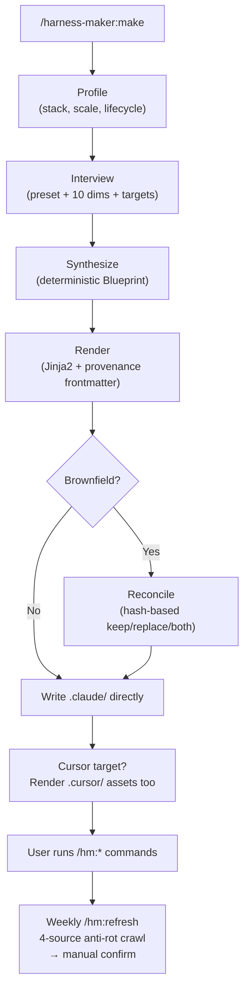

# harness-maker

[](LICENSE)
[](https://www.python.org)
[](https://code.claude.com)
[-black)](https://cursor.com)
[](https://docs.astral.sh/uv/)

> **A harness that knows your project — and stays that way.**

Interview-born. Grade-gated. Anti-rot by design. Dual-IDE.

[Why](#why-harness-maker) ·
[Quickstart](#quickstart) ·
[Features](#features) ·
[How it works](#how-it-works) ·
[Slash commands](#slash-commands-the-harness-exposes) ·
[Comparison](#how-it-compares) ·
[Configuration](#configuration) ·
[Cursor target](#cursor-target) ·
[FAQ](#faq) ·
[Roadmap](#roadmap) ·
[Deep dive](docs/HOW-IT-WORKS.md)

---

## Why harness-maker?

Most Claude Code setups start from a generic template and drift from day one. harness-maker takes a different stance — it builds a harness that is **shaped around your project** and **keeps that shape over time**.

Four principles drive every design decision:

**1. Personalized — Interview-born, not template-pasted.**
The profiler reads your stack, scale, and lifecycle. The interview locks in preset, dev mode, target IDEs, and reviewer depth. A `Side` experiment and a `Production` service get structurally different harnesses — different reviewer sets, different workflow stage counts, different security gates. No generic defaults silently shipped.

**2. Trusted — Grade-gated, not hope-based.**
Every `/hm:execute` runs in a fresh git worktree and follows a TDD loop. `/hm:review` doesn't just report findings — it applies consensus-passed fixes and re-reviews until the grade meets the configured threshold (default A). Pre-LLM mechanical checks (lint, tests) gate the review before any reviewer agent spawns. Reviews you trust don't need second-guessing.

**3. Anti-rot — Built-in, not retrofitted.**
The Claude/Cursor ecosystem moves fast. harness-maker ships a weekly crawl across 4 sources (Anthropic blog, GitHub releases, arxiv cs.SE/CL/CR, OSV.dev), scores each item for relevance, and surfaces only what matters — always manual-confirmed, never auto-applied. The failure-memory system proposes new skills and rules when the same failure recurs 3× across sessions.

**4. Evolving — Refresh cycles, not rewrites.**
`/harness-maker:make --update` picks up new template improvements without touching your edits (hash-based KEEP/REPLACE per file). The session memory and wiki build up project-specific conventions. Failure proposals turn recurring stumbles into permanent fixes. The harness improves with the project, not against it.

---

## Table of Contents

- [Why harness-maker?](#why-harness-maker)
- [Quickstart](#quickstart)
- [Requirements](#requirements)
- [Features](#features)
- [How it works](#how-it-works)
- [Slash commands the harness exposes](#slash-commands-the-harness-exposes)
- [How it compares](#how-it-compares)
- [Configuration](#configuration)
- [Cursor target](#cursor-target)
- [Reconcile rules](#reconcile-rules-re-rendering-an-existing-harness)
- [Observability](#observability)
- [Marketplace](#marketplace)
- [FAQ](#faq)
- [Roadmap](#roadmap)
- [Development](#development)
- [Contributing](#contributing)
- [License](#license)

---

## Quickstart

```bash
# 1. Clone and install (pre-PyPI — editable from clone)
git clone git@github.com:Ecro/harness-maker.git
uv pip install -e ./harness-maker

# 2. Load the plugin in your project
cd your-project
claude --plugin-dir /path/to/harness-maker

# 3. Generate the harness
/harness-maker:make
```

The interview asks for your preset (`Side` or `Production`), locale, dev mode, and target IDEs. A fully-rendered `.claude/` directory is ready in one turn.

Re-run with flags to evolve the harness:

```bash
/harness-maker:make --audit          # score the existing .claude/ against the rubric
/harness-maker:make --add NAME       # graft on a single skill/agent/command
/harness-maker:make --remove NAME    # surgically remove one component
/harness-maker:make --promote NAME   # move an ad-hoc artifact into the harness
```

---

## Requirements

| Dependency | Notes |
|---|---|
| **Python 3.12+** and **[`uv`](https://docs.astral.sh/uv/)** | Required wherever Claude Code runs against your project — even if your project's primary language is Rust, Node, or Go. Hooks invoke `uv run python -m harness_maker.gates.*`; without `uv` they are silent no-ops. |
| **Claude Code CLI** (plugin + hook support) | Loaded via `claude --plugin-dir /path/to/harness-maker`. |
| **Cursor IDE 2.4+** (3.2+ recommended) | Optional. Reads `.claude/agents/`, `.claude/skills/`, and `.claude/commands/hm/*.md` natively (verified empirically in 0.6.2, re-confirmed 0.7.1 — see `tests/cursor-compat/results-2026-05-08.md`). Hooks render to a separate `.cursor/hooks.json` with Cursor-native schema; both files are emitted when `targets` includes `cursor`. Cursor 3.0+ adds native `/worktree` and `/best-of-n` which coexist safely with harness-maker's prefix-matched cleanup. |
| **Git** | Required for worktree isolation (every `/hm:execute` and `/hm:loop` run). |

---

## Features

- **Single command, no subcommand sprawl.** `/harness-maker:make` is the only entry point. Everything else is a flag (`--audit`, `--add`, `--remove`, `--promote`). No muscle-memory tax.

- **Two presets, ten override dimensions.** `Side` (1 reviewer, lean, fast) and `Production` (5 reviewers, verify-required, secure) cover ~90% of teams. The remaining 10% comes from override dimensions surfaced in the interview: workflow naming, models, autoloop, anti-rot, worktree, security, context-lint, memory, caching.

- **Dual IDE — Claude Code + Cursor, single source.** `.claude/agents/`, `.claude/skills/`, `.claude/commands/hm/`, and `.claude/hooks/hooks.json` are shared. Cursor 2.4+ reads them natively — no duplication. Opt into the `cursor` target to additionally render `.cursor/rules/harness.mdc` and `.cursor/mcp.json`.

- **AI-readiness scoring.** `/hm:ai-readiness` runs a 3-layer composite: deterministic structural checks (70%), LLM rubric evaluation (25%), prompt-cache diagnostics (5%). Outputs a 0-100 score with P0/P1/P2 ranked action items and updates `.claude/observability/dashboard.md`. All telemetry stays local.

- **Anti-rot pipeline.** Weekly crawl across 4 sources: Anthropic blog/changelog, GitHub releases (`anthropics/claude-code`), arxiv (cs.SE / cs.CL / cs.CR), OSV.dev CVEs. Each item is LLM-scored for relevance with an adaptive threshold (starts at 0.7, adapts ±0.05 based on your accept/reject history). **Always manual-confirmed** — there is no `--auto-apply` path.

- **Worktree isolation per run.** Every `/hm:execute` runs in a fresh `git worktree` under `.worktrees/`. `/hm:loop` allocates one worktree for the whole loop, shared across iterations to reduce branch churn. Successful runs clean up; failed runs preserve evidence. Prefix-match cleanup never touches Cursor-managed worktrees in the same directory.

- **7 security gates.** `secrets` (regex + entropy, gitleaks-style), `permissions` (`settings.json` over-grant detection), `hook injection` (`hooks.json` AST scan for `rm -rf`, `curl | sh`, `eval`), `dependency CVEs` (OSV.dev), `hallucination` (AST scan for non-existent imports — pure-filesystem check, no execution of LLM-generated code), `prod-name guard` (cross-tool sequence detection for production-targeting patterns), `prompt injection` (hidden-instruction pattern detection + privilege separation, regex + LLM second pass). Findings go to `.claude/observability/security/findings-*.jsonl` — never transmitted.

- **Privilege separation.** Reviewer agents get `permissions.deny: [Write(*), Edit(*), Bash(rm:*), Bash(curl:*), Bash(npm:*), Bash(eval *), Bash(python:*), Bash(node:*), Bash(sh:*), Bash(bash:*)]` — interpreter denies block subprocess-bypass attempts (0.6.2 hardening). Executor agents get `permissions.allow: [Write(.worktrees/**), Edit(.worktrees/**), Bash(uv run:*), Bash(pytest:*), …]` plus paired Edit/Write denies on system paths (`/etc`, `~/.ssh`, `~/.aws`). Combined with worktree isolation and the 0.7.1 telemetry tool-input whitelist + secret redaction (ADR-107), this gives defense-in-depth: even a prompt-injected reviewer cannot write to disk or shell out via interpreters; even a compromised executor cannot write outside the active worktree or touch system credentials; even a poisoned `tool_input` payload cannot leak credentials into the metrics log.

- **Brownfield-safe.** `Reconciler` indexes existing `.claude/`, computes hash-based ours/theirs decisions via provenance frontmatter, and offers per-conflict keep/replace/both. Apply is ADD-only with timestamped backups. User edits are never silently overwritten.

- **Deep interview before every implementation.** `/hm:spec` runs a 6-category interview (Intent → Outcomes → In-Scope Scenarios → Non-Goals → Constraints → Verification) scored for completeness; incomplete categories trigger follow-up questions, not silent gaps. `/hm:plan` runs a 9-category interview (scope → architecture → contract → risk → testing → phasing → dependencies → failure handling → observability) in impact order. Each decision that changes a component boundary, introduces a new contract, or rejects a viable alternative is promoted to a formal **Architecture Decision Record** (ADR) and becomes a binding constraint for `/hm:execute` — not advisory. A `plan-validator` agent gates the plan before it is written to disk: NEEDS_REVISION triggers targeted follow-up rounds; MAJOR_REVISION escalates to the user. The interview ends with a "no deferred decisions" scan — any "Accept?/OK?/Verify?" phrasing is a missed interview round, not a plan checkpoint.

- **Autoloop with adaptive interview and convergence judgment.** `/hm:loop` runs time-and-iteration-bounded loops. Before the first iteration, `autoloop-driver` reads the goal description, extracts already-answered dimensions (purpose / invariants / priority / stopping_criteria / out-of-scope), and asks only what's missing — no fixed question script. A single worktree is shared across all iterations (no per-iteration branch churn). Code writes are delegated to `autoloop-coder` (write-tool-only, bounded scope, no open-ended exploration). Convergence is judged by LLM reading the current state against `stopping_criteria` — not a rule-based checklist — and the loop exits when the predicate is satisfied. Failed iterations preserve the worktree for inspection.

- **Refdocs search skill.** Register your project's reference folders (architecture docs, API specs, design docs) in `harness.yaml`. The `refdocs-search` skill gives the LLM lossless full-text search across all registered folders — no chunking, no RAG index.

- **SessionStart drift reminder.** A hook fires on every session open and warns if the running harness-maker version differs from the version that rendered the harness — so you notice when a `/plugin update` needs a re-render. The detector compares `harness.yaml.harness_maker_version` against the **latest plugin version cached on disk** (not just the imported `__version__`), so `/hm:refresh` and SessionStart agree even when the slash command runs against a pinned older version (0.6.2).

- **Memory tier with cross-process safety.** `.claude/memory/` holds `episodic/` (per-day JSONL), `semantic.jsonl` (queryable index), `profile.json`, `wiki.md`, and `failures.md`. Concurrent writers from parallel sessions are serialised via a re-entrant POSIX flock — same thread can re-acquire without deadlock, different threads block normally (ADR-106, 0.7.1). Telemetry hooks append atomically via raw `os.write()` on `O_APPEND` (single-syscall, ≤ PIPE_BUF) so concurrent Claude Code + Cursor hooks cannot interleave JSONL lines.

- **3-tier context loading + compaction recovery.** Every stage opens memory in tier order — Hot (`session/<today>.md`), Warm (`failures.md` + `wiki.md` first 60/40 lines), Cold (git log / PLANs on demand). `PreCompact` hook flushes the session to `session/<today>.md` with a `checkpoint:compaction` marker before Claude compacts context; the next turn detects the marker and resumes from the last in-progress phase without losing progress.

- **2-pass redaction for review precision (+47 pp).** Reviewers run twice: Pass 1 strips PR title, author, and commit message so findings aren't anchored to metadata; Pass 2 restores full context and each reviewer validates or drops their Pass 1 findings. Findings absent from Pass 2 are dropped (CP10 contract). Ablation showed a +47 percentage-point precision gain on anchoring-prone diffs.

- **Self-improving failure memory.** Every stage appends failure patterns (wrong API usage, broken convention, unexpected build failure) to `failures.md` with a count. When any failure slug reaches count ≥ 3, a proposal is automatically appended to `pending-proposals.md` — suggesting a new skill, rule, or hook that would have prevented the recurrence. The user reviews and decides whether to ingest.

- **ADR system as binding execute constraints.** Architecture Decision Records promoted during `/hm:plan` are hard constraints — `/hm:execute` must not violate them. If a PLAN phase conflicts with an ADR, execute surfaces it as a blocker rather than silently proceeding. ADRs capture rejected alternatives and the reasoning, so future sessions don't re-litigate settled decisions.

- **Cache miss classification (4 reasons).** The prompt-cache diagnostic layer reports why a cache miss occurred: `min_threshold` (content too short), `invalidation` (context changed), `ttl` (5-min TTL expired), or `first` (cold start). The 5% weight in the AI-readiness score distinguishes cold-start misses (benign) from structural misses (actionable), so you fix the right thing.

- **Grade-based auto-fix loop.** `/hm:review` computes a grade (A–F) from `consensus-passed` P0/P1 findings and loops: apply fixes → re-review (selective — only re-spawn reviewers whose scope was touched) → regrade, until grade meets `grade_threshold` (default A) or `max_review_rounds` is exhausted. Failed fixes that break the build are automatically reverted and logged. Weak-consensus and manual-only findings are never auto-applied.

- **Pre-LLM mechanical checks gate.** Add shell commands to `harness.yaml` once and they run at the start of every `/hm:review` — before any reviewer agent spawns. Stop-on-first: the first non-zero exit emits `## MECHANICAL_BLOCK: <cmd> exit=<N>`, halts the review, and exits `CHANGES_REQUESTED`. Lint clean and tests green are enforced mechanically, not by reviewer prompt. `--no-auto-fix` does not skip mechanical checks.

For the complete mechanics behind each feature — all procedures, decision paths, and internal invariants — see [**docs/HOW-IT-WORKS.md**](docs/HOW-IT-WORKS.md).

---

## How it works



**14 mechanisms** (M1-M14) back every feature. See [`docs/ARCHITECTURE.md`](docs/ARCHITECTURE.md) for the full breakdown including the privilege-separation model, security gate triggers, and reconcile invariants.

---

## Slash commands the harness exposes

After install, the rendered harness exposes commands under `/hm:*`:

### Atomic stages (always available)

| Command | Purpose |
|---|---|
| `/hm:research` | Gather information, best practices, explore options |
| `/hm:spec` | Write acceptance criteria from research |
| `/hm:plan` | Decompose spec into phases with exit criteria |
| `/hm:execute` | Implement with TDD + worktree isolation |
| `/hm:review` | Multi-reviewer consensus (conditional routing) |
| `/hm:wrapup` | Clean, document, commit |
| `/hm:verify` | 6-check gate before completion |

### Fused workflows (preset-generated, user-renameable)

| Preset | Default fused workflows |
|---|---|
| **Side** | `/hm:plan-exec-rev` · `/hm:exec-rev` · `/hm:exec-rev-wrap` _(default)_ |
| **Production** | `/hm:exec-rev-wrap-ver` _(default)_ · `/hm:exec-rev-wrap` · `/hm:plan-exec-rev` · `/hm:exec-rev` · `/hm:res-spec-plan` |

### Utility commands

| Command | Purpose |
|---|---|
| `/hm:loop "<goal>"` | Autoloop driver — `feature` or `improve` mode, time/iter-bounded |
| `/hm:ai-readiness` | 3-layer readiness score + P0/P1/P2 ranked actions |
| `/hm:refresh` | Anti-rot crawl — manual confirm required |

---

## How it compares

Other Claude Code harnesses pick a niche; harness-maker is the **meta-tool** that builds them.

| Project | Scope | What harness-maker adds |
|---|---|---|
| **ohmyclaudecode** | Curated commands/agents bundle | Project-tailored synthesis (preset + 10 override dims), brownfield reconcile, provenance frontmatter, anti-rot pipeline |
| **superpowers** | Powerful sub-agents and workflows | Single-command entry, AI-readiness scoring, worktree isolation by default, privilege-separated reviewer/executor |
| **Archon** | Knowledge-base + RAG-backed planning | Stack/scale/lifecycle profiler, atomic+fused workflow engine, conditional reviewer routing, 5 security gates |
| **aider** | Terminal pair programmer, LLM-agnostic | Claude Code / Cursor IDE native; harness output is the runtime (not the session); anti-rot keeps it current |
| **ouroboros** | Autonomous self-bootstrapping AI software factory | Project-shaped interview (not one pipeline for all), grade-gated reviews with mechanical pre-checks, anti-rot pipeline, brownfield reconcile, dual-IDE support |
| **Hand-rolled `.claude/`** | Full control, zero automation | Drift detection via provenance hash, weekly anti-rot crawl, AI-readiness scoring, worktree isolation — without writing it yourself |

harness-maker treats the `.claude/` directory itself as the artifact and gives it a lifecycle: profile → interview → synthesize → render → reconcile → verify → refresh.

---

## Configuration

The interview writes answers to `.claude/harness.yaml`. Key dimensions:

```yaml
preset: Production           # Side | Production
locale: en                   # en | ko | <any — unknown falls back to en>
dev_mode: spec-driven        # spec-driven | task-driven
targets:                     # which IDEs to drive
  - claude-code
  - cursor
recommended_model: claude-opus-4-7

reviewers:
  enabled: [code, security, performance, ux, concurrency]
  routing: conditional       # conditional | always-all
  mechanical_checks:         # pre-LLM stop-on-first gate (optional)
    - ruff check .
    - uv run pytest tests/unit -x -q

worktree:
  scope: [execute, plan]     # which stages run in a fresh worktree
  cleanup: on_success        # on_success | always | never

anti_rot:
  enabled: true
  threshold: 0.7             # adaptive — adjusts ±0.05 based on accept/reject ratio

context_lint:
  strict: true               # warn on overrun | block

memory:
  files: [failures.md, wiki.md]
```

Run `/harness-maker:make` again and choose **Update** (same settings, pick up template improvements) or **Full reconfigure** to change any dimension.

---

## Cursor target

Run `/harness-maker:make` and pick `targets: [cursor]` or `[claude-code, cursor]` at the interview. The renderer adds:

- `.cursor/rules/harness.mdc` — always-on workflow rules with Cursor-legal frontmatter (`description` / `globs: []` / `alwaysApply: true`)
- `.cursor/hooks.json` — Cursor-native hooks schema (lowercase camelCase keys, `version: 1`, flat `{matcher, command}`). **Deliberately different from `.claude/hooks/hooks.json`** (PascalCase, nested `{hooks:[…], matcher}`); each IDE reads only its own file. Don't try to collapse them — Cursor will silently stop firing hooks. See `tests/cursor-compat/results-2026-05-08.md` for the kairos 0.5.7 forensic that proved this empirically.
- `.cursor/mcp.json` — Cursor MCP server config. Populated from `harness.yaml.mcp_servers` (0.6.2+); defaults to `{"mcpServers": {}}` when no servers are configured. Inner shape (`command`, `args`, `env`) is type-validated on parse with a warning log when entries are dropped.

`.claude/agents/`, `.claude/skills/`, and `.claude/commands/hm/` are single-source — Cursor 2.4+ reads them natively (forensic-verified). Hooks are the only asset that requires per-IDE rendering because the schemas diverge by design.

### Recommended model

`harness.yaml.recommended_model` defaults to `claude-opus-4-7` and propagates to agent frontmatter. Cursor users may override model selection in their IDE. The harness does **not** rewrite prompts to be model-agnostic — `<thinking>` blocks and Claude-specific patterns are preserved deliberately.

### Verification

Per-release Cursor compatibility is tracked in `tests/cursor-compat/`:

- `MANUAL_CHECKLIST.md` — A1–A4 (agent dispatch, hook fire, skill auto-discovery, slash command + Q&A loop) covering both IDEs
- `RESULTS.md` — PASS/FAIL/PARTIAL grid you fill while running the checklist
- `results-2026-05-08.md` — kairos 0.5.7 forensic that resolved Q-A (hooks discovery) and Q-B (commands discovery) without an IDE-driven manual run; future Cursor verifications append a new dated `results-*.md`
- `fixture/` — minimal `.claude/` for opening directly in either IDE

Automated CI guards the dual-schema invariants regardless of manual fixture runs:

- `test_cursor_hooks_uses_lowercase_native_schema` — fails if `.cursor/hooks.json` accidentally adopts Claude PascalCase
- `test_no_cursor_commands_rendered` — fails if a future change starts emitting `.cursor/commands/hm-*.md` mirrors (Cursor reads `.claude/commands/` natively)
- `test_render_agents_have_structured_permissions_frontmatter` — fails if any agent template loses its `permissions.allow/deny` block (Cursor 2.5+ subagent permission inheritance gap)

---

## Reconcile rules (re-rendering an existing harness)

Re-running `/harness-maker:make` on an existing harness uses a hash-driven KEEP rule: if a file's `content_hash` frontmatter matches the new template's hash, it's "ours" — safe to overwrite. If it differs (user-edited), it's "theirs" — kept.

**Trade-off**: when harness-maker bumps a template on a minor release, the existing file's hash no longer matches, so reconcile picks KEEP even if you didn't edit the file.

To pick up template updates after a version bump:

```bash
rm .claude/harness.yaml
/harness-maker:make
# (previous .claude/ is auto-backed up to .backup-<ISO>/)
```

`.cursor/rules/*.mdc` follow the same KEEP behavior. A future phase introduces a sidecar `.hm-meta.yaml` so harness-maker can hash-track Cursor assets without polluting Cursor frontmatter.

---

## Observability

All observability is 100% local — nothing is transmitted externally.

| File | Contents |
|---|---|
| `.claude/observability/dashboard.md` | AI-readiness score, dimension breakdown, ranked action items |
| `.claude/observability/metrics-YYYY-MM-DD.jsonl` | Per-turn telemetry (cache hit %, tool calls, durations) — date-rotated daily (ADR-103, 0.7.1). Pre-0.7.1 `metrics.jsonl` is read as the trailing legacy shard. |
| `.claude/observability/refresh/raw-*.jsonl` | Anti-rot crawl evidence (accepted / rejected items) |
| `.claude/observability/security/findings-*.jsonl` | 5-gate security scan findings |

Run `/hm:ai-readiness` to regenerate the dashboard on demand.

---

## Marketplace

Both manifests are marketplace-ready:

- `.claude-plugin/plugin.json` — Claude Code plugin spec
- `.cursor-plugin/plugin.json` — Cursor Marketplace spec

Listing on either marketplace is **pending**. Until then, install locally:

```bash
# Claude Code
claude --plugin-dir /path/to/harness-maker

# Cursor — open the repo folder directly in Cursor as a workspace plugin
```

---

## FAQ

**Q: Why Python? My project is Rust / Node / Go.**
The hooks (`permission_gate`, `worktree_gate`, `telemetry`) call `uv run python -m harness_maker.*` at PreToolUse / PostToolUse boundaries. This doesn't touch your project's toolchain — `uv` and `harness_maker` need to be on the path, but only to run hooks. Your project's build system is untouched.

**Q: Why does it require `uv`?**
`uv` gives a hermetic, fast Python environment without polluting the system or your project's virtualenv. Hooks run in milliseconds without activating anything.

**Q: Will harness-maker overwrite my hand-edits when I re-render?**
No. Every generated file carries a `content_hash` in its provenance frontmatter. Re-render compares the new template's hash against the file on disk. If they differ — meaning you edited the file — it keeps yours. See [Reconcile rules](#reconcile-rules-re-rendering-an-existing-harness).

**Q: What's the difference between `Side` and `Production`?**
`Side` is lean: 1 reviewer (code), verify-before-completion optional, worktree scope `[execute]`. `Production` is thorough: 5 reviewers, verify required, worktree scope `[execute, plan]`, security on high-finding = block. Both share the same anti-rot and caching defaults.

**Q: Does anti-rot ever auto-apply?**
Never. Every anti-rot item surfaces via `AskUserQuestion` in `/hm:refresh`. There is no `--auto-apply` flag and no plan to add one. The rationale: a wrong patch is worse than a stale harness.

**Q: Can I use only Claude Code? Only Cursor? Both?**
Yes to all three. `targets` is a multi-select at the interview. Single-source `.claude/` assets work in either IDE; Cursor-only files (`.cursor/rules/`, `.cursor/mcp.json`) render only when `cursor` is in `targets`.

**Q: Do my prompts or telemetry leave my machine?**
No. `metrics.jsonl`, dashboard, and security findings are written to `.claude/observability/` locally. Anti-rot crawls *read* public sources (Anthropic blog, arxiv, GitHub, OSV.dev) but never uploads anything.

**Q: How do I pick up template improvements after a `/plugin update`?**
Run `/harness-maker:make` → choose **Update**. For files where your hash matches the old template, the new version is applied. For files you edited (hash mismatch), yours is kept. To force a full refresh, `rm .claude/harness.yaml` and re-run.

**Q: What are `mechanical_checks` and when should I use them?**
Shell commands listed under `reviewers.mechanical_checks` in `harness.yaml` run at the start of every `/hm:review` — before any LLM reviewer spawns. The first command that exits non-zero emits `## MECHANICAL_BLOCK: <cmd> exit=<N>` and halts review immediately (`CHANGES_REQUESTED`). Use them for fast, deterministic gates (lint, type-check, unit test) that shouldn't waste LLM tokens when the basics are broken. The list is user-managed; harness-maker never populates it automatically. `--no-auto-fix` does not skip mechanical checks — they are a hard gate, not part of the fix loop.

**Q: Why doesn't harness-maker rewrite prompts to be model-agnostic?**
The prompts are tuned for `claude-opus-4-7` — `<thinking>` blocks, role framing, chain-of-thought structure. Rewriting for model-neutrality would degrade quality on the recommended model for hypothetical gains on others. Override `recommended_model` in `harness.yaml` if you want a different model; the prompts remain as-is.

---

## Roadmap

- **PyPI publish** — remove the editable-from-clone requirement.
- **Claude Code + Cursor Marketplace listings** — submit both plugin manifests.
- **`.hm-meta.yaml` sidecar for Cursor assets** — enable hash-tracking of `.cursor/rules/*.mdc` without polluting Cursor frontmatter, unblocking auto-upgrade for Cursor-target files.
- **User-configurable anti-rot repo list** — `harness.yaml.anti_rot.github_repos` to track additional Claude Code ecosystem repos beyond the default.
- **Demo screencast** — record a first-install + `/hm:loop` session.
- **`Enterprise` preset** — stricter security gates, mandatory spec-driven dev mode.

---

## Development

```bash
uv sync
uv run pytest                       # full suite
uv run ruff check src/ tests/       # lint
uv run ruff format src/ tests/      # format
uv run mypy --strict src/           # type check
bash .claude-verify.sh all          # phase-by-phase exit criteria + final acceptance
```

---

## Contributing

See [`docs/CONTRIBUTING.md`](docs/CONTRIBUTING.md) for adding skills/agents/presets, test patterns, and the PR checklist (including the 4-file version bump invariant).

See [`docs/ARCHITECTURE.md`](docs/ARCHITECTURE.md) for the 14 mechanisms (M1-M14) behind the system.

---

## License

MIT — see [LICENSE](LICENSE).
