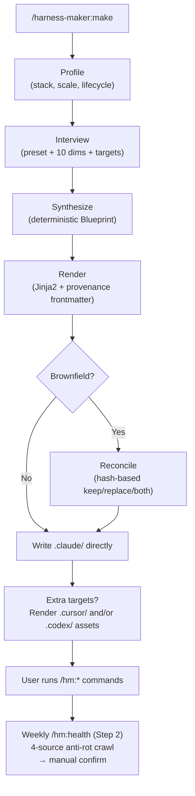

<p align="center">
  
</p>

# harness-maker

[](LICENSE)
[](https://www.python.org)
[](https://code.claude.com)
[-black)](https://cursor.com)
[](https://docs.astral.sh/uv/)

**English** · [한국어](https://github.com/Ecro/harness-maker/blob/main/README.ko.md)

> **A different harness for every project — built from yours, never generic.**

> Other harnesses give everyone the same starting point. harness-maker reads YOUR repo and builds YOUR harness.
>
> 📸 **[See it on two real projects →](docs/assets/showcase-diff.md)** — same maintainer, same Python stack, +5 agents and +15 multi-IDE files between Side and Production preset renders.

**Per-project personalization** · Grade-gated · Self-evolving · Multi-IDE

[Why](#why-harness-maker) ·
[How it fits](#how-it-fits-your-project) ·
[Quickstart](#quickstart) ·
[Features](#features) ·
[How it works](#how-it-works) ·
[Slash commands](#slash-commands-the-harness-exposes) ·
[Comparison](#how-it-compares) ·
[Configuration](#configuration) ·
[Targets](#targets) ·
[FAQ](#faq) ·
[Stability](#stability) ·
[Roadmap](#roadmap) ·
[Deep dive](docs/HOW-IT-WORKS.md)

---

## Try in 30 seconds

Paste this into Claude Code, Cursor, or Codex CLI. **A profiler reads 12+ stack signals + a 10-dimension interview synthesizes a harness specific to YOUR project** — not a generic template. It auto-detects your IDE, installs harness-maker via Bash (no slash-command typing), runs the interview, and prints a personalization-tier report.

```
Install harness-maker for this project and bootstrap the harness end-to-end.

You are an AI agent running inside Claude Code, Cursor, or Codex CLI.
Detect which one (silently — don't ask me), install harness-maker via
Bash (NOT slash commands typed by me), then invoke harness-maker:make and
hm:health via the Skill tool. Conduct the conversation in the language of
my first reply.

Install path per IDE:
  Claude Code:  Bash  claude plugin marketplace add Ecro/harness-maker
                Bash  claude plugin install harness-maker@harness-maker
                Then tell me: "Type /reload-plugins, then send any short message (e.g. `go`) to re-trigger me."
  Cursor:       Bash  git clone --depth 1 https://github.com/Ecro/harness-maker.git ~/.cursor/plugins/local/harness-maker
                Then tell me: "Reload the Cursor window (Ctrl+Shift+P → Reload Window)."
  Codex CLI:    Codex has no native marketplace install for this plugin.
                Use one of these two install paths via Bash:
                A. If `claude` CLI is on PATH (Codex coexisting with Claude Code):
                     Bash  claude plugin marketplace add Ecro/harness-maker
                     Bash  claude plugin install harness-maker@harness-maker
                B. Otherwise install via PyPI:
                     Bash  uv tool install harness-maker
                After install, invoke harness-maker:make directly — `.codex/`
                artifacts are produced by `make`, not by a Codex plugin reload.

After install, run harness-maker:make (drive the interview — accept defaults
unless I object), then hm:health (read out the personalization tier and top
action items).
```

> **Bash approval:** approve only the exact install commands shown above (`claude plugin install …`, `git clone --depth 1 https://github.com/Ecro/harness-maker.git …`, `uv tool install harness-maker`). Do **NOT** grant blanket `Bash(*)`. If the AI requests a different command (especially any `codex plugin …` variant — Codex has no working native install path for this plugin today), stop and inspect.

For the long form (per-IDE action counts, manual install fallbacks, integrity-pin guidance), see [Quickstart](#quickstart) below.

---

## Why harness-maker?

Most AI coding setups start from a generic template and drift from day one — same reviewer set on every project, same prompts on every stack, same defaults that nobody ever revisits. harness-maker takes the opposite stance: **the harness is shaped by your project, and it keeps that shape as the project moves.**

| | Principle | What this means in practice |
|--|---|---|
| 🎯 | **Personalized** | Profiler reads 12+ stack/framework/CI signals. Interview locks 10+ dimensions. A `Side` experiment and a `Production` service get **structurally different** harnesses — different reviewer sets, different workflow stages, different security gates. No generic defaults silently shipped. |
| 🛡️ | **Trusted** | Every `/hm:execute` runs in a fresh worktree with a TDD loop. `/hm:review` doesn't just report — it applies consensus-passed fixes and re-reviews until grade ≥ A. Mechanical checks (lint/tests) gate the LLM reviewer before any token is spent. |
| 🌱 | **Self-evolving** | Hand-edit any agent, skill, CLAUDE.md — block-merge markers preserve your edits across `--update`. Memory accumulates project-specific patterns; recurring failures auto-propose new guardrails. |
| 🎛️ | **Multi-IDE** | Claude Code + Cursor + Codex. One `harness.yaml`, three target-native renders. Existing Cursor rules / Aider config / Copilot instructions get absorbed on first run — no manual port. |

---

## How it fits your project

```
SENSE  →  DECIDE  →  RENDER  →  EVOLVE
```

Four steps. Each is a question harness-maker answers for you — once, then continuously.

### 1. SENSE — *What kind of project is this?*

The profiler scans concrete signals **before** asking you anything. Every detection is tagged with a confidence (HIGH / MEDIUM / LOW) that decides whether the default is applied silently, prompted, or skipped.

| Signal | Detection source |
|---|---|
| **Stack** (12+) | `pyproject.toml`, `package.json`, `Cargo.toml`, `go.mod`, `pubspec.yaml`, … + extension counts |
| **Scale** | Total source files, monorepo depth, presence of `apps/` or `packages/` |
| **Lifecycle** | Git commit velocity, branch protection rules, CI workflow presence |
| **Frameworks** | React / Vue / FastAPI / Django / Tauri / Zephyr / Next.js / Tailwind / Pydantic … (dependency-parsed, not keyword-guessed) |
| **Package manager** | uv · poetry · pnpm · yarn · cargo · go mod · gradle · maven |
| **CI provider** | GitHub Actions · GitLab CI · CircleCI · Bitbucket Pipelines |
| **Foreign AI config** | Pre-existing `.cursor/rules/`, `AGENTS.md`, `CLAUDE.md`, `.continue/`, `.aider.conf.yml`, `.github/copilot-instructions.md` |

> **Result:** A 24-hour cached `ProjectProfile` you can inspect with `harness-maker profile . --json` before any interview runs.

---

### 2. DECIDE — *What harness does this project need?*

A short interview locks the dimensions that shape every downstream render. Re-runs silently reuse prior answers; explicit `--reinterview` re-prompts.

| Dimension | Choices | What it changes |
|---|---|---|
| **Preset** | `Side` · `Production` | Reviewer count (1 vs 5), workflow stage count, security gate depth, verify-required flag |
| **Dev mode** | `task-driven` · `spec-driven` | Whether SPEC stage is mandatory; whether plan stages chain into execute |
| **Targets** | `claude-code` · `cursor` · `codex` (multi-select) | Which IDE-native asset trees are rendered |
| **Locale** | `en` · `ko` · any tag | Interview text + user-facing error messages |
| **Workflows** | Fused sequences from atomic stages | Which `/hm:<name>` slash commands appear |
| **Reviewers / skills** | Preset defaults + overrides | Which agents and skills install |
| **Ref folders** | Path + glob pairs | Which external docs are searchable via `refdocs-search` skill |
| **Sibling repos** | Relative paths | Which adjacent repos share the same harness session |
| **Second Brain** | Obsidian vault path + project_id | Where cross-session memory writes |
| **Recommended model** | `claude-opus-4-7` default | The model frontmatter on every generated agent |

> **Result:** `.claude/harness.yaml` — a single source of truth that survives upgrades.

---

### 3. RENDER — *How does this become a working harness?*

One source tree, three IDE-native renders, all from a single `harness.yaml`:

```
.claude/                 ← single source: agents, skills, commands/hm/, hooks, memory, observability
├── .cursor/             ← + Cursor-native rules, hooks, mcp.json     (if cursor target)
├── .codex/              ← + Codex-native config.toml, agent TOMLs    (if codex target)
├── AGENTS.md            ← + Codex root instructions                  (if codex target)
└── .agents/skills/      ← + Codex skill paths                        (if codex target)
```

Layered on top of the base render:

- **Domain packs** — `--add-domain python` inlines a stack-specific standards block into the 5 reviewer agents (code, security, performance, concurrency, ux). `python` is the only sample that ships pre-filled; `--add-domain <other>` scaffolds a blank user-side stub at `.claude/agents/_standards/<name>.md` for teams to fill in without forking harness-maker.
- **Foreign config absorption** — pre-existing Cursor rules, Aider config, Copilot instructions get LLM-translated into `harness.yaml` axes. `@hm:harness:*` inverted markers keep them synced on re-renders.
- **Sibling repos** — frontend + backend + library share one harness session via relative-path bindings in `harness.yaml`. Cross-machine portable.
- **Ref folders + Second Brain** — registered project docs + Obsidian vault notes become searchable from any stage.

> **Result:** Every IDE you use sees the same agents, the same skills, the same workflows — natively. Zero manual porting.

---

### 4. EVOLVE — *How does the harness stay useful?*

Three independent feedback loops keep the harness aligned with your project as it grows.

**A. Your edits survive upgrades.**
Hand-tune `agents/code-reviewer.md`. Add a custom skill. Edit a CLAUDE.md section. All survive `harness-maker make --update` because content hashes per file plus `@hm:user:*` block-merge markers separate your edits from template-owned regions. `@hm:harness:*` inverted markers do the opposite (for foreign config: preserve outside, replace inside).

**B. The harness learns your project.**
- `.claude/memory/wiki.md` — patterns, conventions, gotchas. Each `/hm:wrapup` appends new entries.
- `.claude/memory/failures.md` — recurring mistakes, deduplicated by slug + count.
- `.claude/memory/session/<date>.md` — non-obvious decisions per workday.
- When any failure slug reaches **count ≥ 3**, wrapup writes a proposal to `pending-proposals.md` — a new skill, rule, or hook that would have prevented the recurrence. The user reviews and decides whether to ingest.

**C. Defaults adapt to your overrides.**
Override telemetry (100% local) tracks every time you change a default. `/hm:health` scores three layers — detection→recommendation conversion, override stability, audit cadence — and surfaces a **Bronze → Silver → Gold → Platinum** tier with ranked action items. Drift the harness too far from your real usage and the audit will tell you exactly which default is wrong.

> **Result:** The harness improves with the project, not against it. No silent re-litigation of decisions you've already made.

For the mechanics behind each step — full procedures, decision paths, internal invariants — see [**docs/HOW-IT-WORKS.md**](docs/HOW-IT-WORKS.md).

---

## Table of Contents

- [Why harness-maker?](#why-harness-maker)
- [How it fits your project](#how-it-fits-your-project)
- [Quickstart](#quickstart)
- [Requirements](#requirements)
- [Features](#features)
- [How it works](#how-it-works)
- [Slash commands the harness exposes](#slash-commands-the-harness-exposes)
- [How it compares](#how-it-compares)
- [Configuration](#configuration)
- [Targets](#targets)
- [Reconcile rules](#reconcile-rules-re-rendering-an-existing-harness)
- [Observability](#observability)
- [Marketplace](#marketplace)
- [FAQ](#faq)
- [Roadmap](#roadmap)
- [Development](#development)
- [Contributing](#contributing)
- [License](#license)

---

## Quickstart

### Universal Bootstrap Prompt

> **Paste into your AI agent — it detects whether you're in Claude Code, Cursor,
> or Codex, runs the matching plugin install via Bash (no slash-command typing
> by you), and bootstraps the harness end-to-end.** One paste, every supported IDE.

**Per-IDE user actions** (the AI does the rest):

| IDE | Paste | Typed slash | GUI / restart action | Total user actions |
|---|---|---|---|---|
| **Claude Code** | 1 | 1 (`/reload-plugins`) | 1 short message (e.g. `go`) to re-trigger Claude | **3** |
| **Cursor** | 1 | 0 | 1 (`Ctrl+Shift+P → Reload Window`) | **2-3** |
| **Codex CLI** | 1 | 0 | 0 (no Codex reload needed — `.codex/` artifacts come from `make`, not a plugin) | **2** |

> **Codex CLI install path.** harness-maker has no native Codex marketplace registration today; adding this repo via `codex plugin marketplace add` accepts the marketplace root but the subsequent `codex plugin add` fails with "plugin not found". The AI must install via Claude Code's marketplace (if `claude` CLI is on PATH) OR via PyPI (`uv tool install harness-maker`) — both are working install paths that result in the same `.codex/` rendered artifacts on disk.

> **First-use Bash approval.** Claude Code / Cursor / Codex CLI will request Bash permission for the install commands shown below. Approve **only** the exact commands in the prompt (`claude plugin install harness-maker@harness-maker`, `git clone --depth 1 https://github.com/Ecro/harness-maker.git ~/.cursor/plugins/local/harness-maker`, or `uv tool install harness-maker`). Do **NOT** grant blanket `Bash(*)` — if the AI requests a different command, stop and inspect. The Cursor clone fetches the current `main` branch of a public repo; future `git pull` updates are not integrity-verified — pin a release tag manually if this matters for your threat model.

```
Install harness-maker for this project and bootstrap the harness end-to-end.

You are an AI agent running inside one of: Claude Code, Cursor, or Codex CLI.
Detect which one (silently — do NOT ask me), run the matching plugin install
via Bash (NOT slash commands typed by me), then invoke harness-maker:make
and hm:health via the Skill tool.

Step 1 — Detect the host IDE (silent):
  - Claude Code  → $CLAUDE_CODE is set, or ~/.claude/ exists, or you have
                   the Bash tool with access to the `claude` CLI
  - Cursor       → $CURSOR_SESSION is set, or ~/.cursor/ exists, or you have
                   Cursor's plugin manager available
  - Codex CLI    → $CODEX_SESSION is set, or ~/.codex/ exists, or the
                   `codex` command is on PATH

Step 2 — Install harness-maker as a plugin via Bash (skip when the
harness-maker:make skill is already available):

  IF Claude Code:
    Bash: claude plugin marketplace add Ecro/harness-maker
    Bash: claude plugin install harness-maker@harness-maker
    Then tell me verbatim: "Type /reload-plugins, then send any short message (e.g. `go`) to re-trigger me."

  IF Cursor:
    Bash: git clone --depth 1 https://github.com/Ecro/harness-maker.git ~/.cursor/plugins/local/harness-maker
    Then tell me verbatim: "Reload the Cursor window now (Ctrl+Shift+P → Reload Window)."

  IF Codex CLI:
    Codex has no native marketplace install for this plugin
    (registering this repo as a Codex marketplace accepts the
    marketplace root, but the subsequent `codex plugin add` fails
    with "plugin not found"). Pick whichever install path works
    on this machine:
    A. If `claude` CLI is on PATH (Codex coexists with Claude Code):
       Bash: claude plugin marketplace add Ecro/harness-maker
       Bash: claude plugin install harness-maker@harness-maker
    B. Otherwise install via PyPI:
       Bash: uv tool install harness-maker
    No Codex reload is needed — `.codex/` artifacts are produced
    by `harness-maker make`, not by a Codex plugin.

  IF you can't tell which IDE (or none of the above), STOP and ask me which
  IDE you're in.

Step 3 — After I confirm the reload (Claude Code / Cursor only — Codex
needs no reload; for Codex, proceed immediately after install), invoke
harness-maker:make via the Skill tool (do NOT ask me to type any slash
command) and drive the interview:
  • Confirm preset (Side / Production), dev mode, target IDEs, and locale.
  • Accept the recommended defaults unless I object.

Step 4 — After harness-maker:make finishes, invoke hm:health via the Skill tool
(again, do NOT ask me to type it):
  Produces a 3-section dashboard at .claude/observability/dashboard.md
  (structural / external-risks / personalization). Tell me the personalization
  tier and any high-priority action items.

Conduct the conversation in the language of my first reply; default to English
if you cannot tell.
```

<details>
<summary><strong>Manual install — pick one for your IDE</strong></summary>

#### Claude Code (plugin marketplace)

```
/plugin marketplace add Ecro/harness-maker
/plugin install harness-maker@harness-maker
```

The marketplace metadata and the plugin both ship in this repo, so two commands cover discovery + install. Reload Claude Code; `/harness-maker:make` becomes available.

#### Codex CLI (no native marketplace — use Claude Code or PyPI)

**Codex CLI does not currently support installing harness-maker natively.** Registering this repo as a Codex marketplace via `codex plugin marketplace add` accepts the marketplace root, but `codex plugin add harness-maker@harness-maker` then fails with `plugin 'harness-maker' was not found in marketplace 'harness-maker'` because the repo ships no Codex `marketplace.json`. The plugin manifest at `.codex-plugin/plugin.json` is a stub for future native install; **do not rely on it today**.

Two working install paths for Codex CLI users:

**A. Claude Code marketplace (if you have Claude Code installed locally):**

```bash
claude plugin marketplace add Ecro/harness-maker
claude plugin install harness-maker@harness-maker
```

The Python source lands in `~/.claude/plugins/cache/harness-maker-local/`. `harness-maker make` becomes available and renders `.codex/` artifacts that reference the cached Python install. This is the canonical install path — same source-of-truth as Claude Code and Cursor users.

**B. PyPI (Codex-only, no Claude Code subscription needed):**

```bash
uv tool install harness-maker
```

The `harness-maker` CLI is installed via `uv`; `harness-maker make` then renders `.codex/` artifacts. This is the right path for users who run Codex CLI without Claude Code.

After install, `harness-maker make` is the entry point for both paths — there is no Codex plugin reload step.

#### Cursor (Team marketplace import OR local symlink)

Cursor's public plugin marketplace is curated ([cursor.com/marketplace/publish](https://cursor.com/marketplace/publish), submit-and-review). Direct GitHub install is still on the roadmap as of Cursor 2.5+. Two working paths today:

**A. Team marketplace (Team / Enterprise plans):**
Dashboard → Settings → Plugins → Team Marketplaces → Import → paste `https://github.com/Ecro/harness-maker` → push to team members.

**B. Local dev install (community pattern):**

```bash
git clone https://github.com/Ecro/harness-maker.git ~/.cursor/plugins/local/harness-maker
```

Reload Cursor (Ctrl+Shift+P → "Reload Window") to pick up the new plugin.

#### PyPI (no IDE plugin — CI, headless, scripts)

For environments where no IDE plugin path applies (CI scripts, headless servers, automation, or strong preference for a Python CLI tool):

```bash
uv tool install harness-maker          # POSIX / macOS / WSL
# Native Windows / PowerShell:
irm https://astral.sh/uv/install.ps1 | iex
uv tool install harness-maker
```

Then:

```bash
cd your-project
harness-maker profile . --json
harness-maker make . --preset Production --locale en --targets claude-code,cursor
```

This path is fine for one-off renders but skips the in-IDE slash-command surface — `/hm:health`, `/hm:plan`, `/hm:execute`, etc. only appear after the IDE plugin loads them.

</details>

After the harness is rendered, re-run with flags to evolve it:

```bash
harness-maker make . --audit           # score the existing .claude/ against the rubric
harness-maker make . --add NAME        # graft on a single skill/agent/command
harness-maker make . --remove NAME     # surgically remove one component
harness-maker make . --promote NAME    # move an ad-hoc artifact into the harness
```

---

## Requirements

| Dependency | Notes |
|---|---|
| **Python 3.12+** and **[`uv`](https://docs.astral.sh/uv/)** | Required wherever Claude Code runs against your project — even if your project's primary language is Rust, Node, or Go. Hooks invoke `uv run python -m harness_maker.gates.*`; without `uv` they are silent no-ops. |
| **Claude Code CLI** (plugin + hook support) | Optional for plugin mode (`claude --plugin-dir /path/to/harness-maker`). Not required — the `harness-maker` CLI can generate harnesses independently. |
| **Cursor IDE 2.4+** (3.2+ recommended) | Optional. Reads `.claude/agents/`, `.claude/skills/`, and `.claude/commands/hm/*.md` natively (verified empirically in 0.6.2, re-confirmed 0.7.1 — see `tests/cursor-compat/results-2026-05-08.md`). Hooks render to a separate `.cursor/hooks.json` with Cursor-native schema; both files are emitted when `targets` includes `cursor`. Cursor 3.0+ adds native `/worktree` and `/best-of-n` which coexist safely with harness-maker's prefix-matched cleanup. |
| **OpenAI Codex CLI** | Optional. When `targets` includes `codex`, harness-maker renders Codex-native `.codex/` config, `AGENTS.md`, and `.agents/skills/` assets from the same workflow definitions. |
| **Git** | Required for worktree isolation (every `/hm:execute` and `/hm:loop` run). |

---

## Features

Grouped by what they do for your project, not by component.

### 🎯 Personalization — *fits your project*

- **Project-shaped harness.** Profiler + 10-dimension interview produce **structurally different** harnesses for Side experiments vs Production services. Reviewer count, workflow stages, security gate depth, mechanical-check enforcement — all derived from your answers.
- **12+ stack detection.** Python · Node · Rust · Java · Kotlin · Swift · Dart · Ruby · PHP · C# · Elixir · Scala · C/C++ · Zig · Haskell. Framework + package-manager + CI provider parsed from manifests, not keyword-guessed. 24h cache ceiling on manifest mtime.
- **Confidence-bucketed defaults.** Every detection declares HIGH/MEDIUM/LOW confidence. HIGH → silent default with `# detected:` provenance. MEDIUM → explicit interview prompt. LOW → skipped (you decide). Regression test guards against surprise silent-default changes between minor versions.
- **Adaptive personalization tier.** `/hm:health` scores three layers (detection→recommendation conversion, override stability, audit cadence) and reports Bronze → Silver → Gold → Platinum tier. Auto-proposes default changes when one axis has been overridden 5+ times. 100% local telemetry; nothing leaves the project.
- **Domain packs.** `--add-domain python` inlines stack-specific standards into the 5 reviewer agents. `python` is the only pre-filled sample; other domain names scaffold blank user-side stubs that teams fill in without forking harness-maker.
- **Single command, no subcommand sprawl.** `/harness-maker:make` is the only entry point. Everything else is a flag (`--audit`, `--add`, `--remove`, `--promote`, `--add-domain`, `--reinterview`, `--update`).

### 🛡️ Trust — *grade-gated work*

- **Grade-based auto-fix loop.** `/hm:review` doesn't just report. It applies consensus-passed fixes → re-reviews (selectively, only reviewers whose scope was touched) → regrades, until grade ≥ threshold (default A) or `max_review_rounds` is exhausted. Weak-consensus and manual-only findings are never auto-applied.
- **Mechanical pre-checks before any LLM token.** Lint clean + tests green are enforced **before** reviewers spawn. First non-zero exit emits `## MECHANICAL_BLOCK: <cmd> exit=<N>` and halts. `--no-auto-fix` does not skip this gate.
- **Conditional reviewer routing.** `.env` change → security-reviewer. `/perf/` → performance-reviewer. `.tsx` → ux-reviewer. Async/locking → concurrency-reviewer. 10× cheaper than fanning out to every reviewer on every diff.
- **2-pass redaction (+47pp precision).** Pass 1 strips PR metadata so findings can't anchor on author/title. Pass 2 restores full context — reviewers must validate or drop each Pass 1 finding. Ablation-measured precision gain on anchoring-prone diffs.
- **7 security gates.** `secrets` · `permissions` (settings.json over-grant) · `hook-injection` (AST scan for `rm -rf`, `curl|sh`, `eval`) · `CVEs` (OSV.dev) · `hallucination` (AST scan for non-existent imports) · `prod-name guard` · `prompt-injection`. Findings stay local in `.claude/observability/security/`.
- **Privilege separation.** Reviewer agents deny `Write` / `Edit` / interpreter `Bash` calls. Executor agents allow only `.worktrees/**` writes + paired Edit/Write denies on system paths. Defense-in-depth survives prompt injection, agent compromise, and tool_input poisoning.
- **Worktree isolation per run.** Every execute runs in a fresh `git worktree`. Failed runs preserve evidence; successful runs auto-cleanup with prefix-match (Cursor's own worktrees never touched).

### 🌱 Self-evolving — *grows with your project*

- **Block-merge preservation.** Hand-tune any agent, skill, CLAUDE.md section. Survives `--update` because content hashes per file plus `@hm:user:*` markers separate your edits from template-owned regions. `@hm:harness:*` inverted markers do the opposite for foreign config absorption.
- **Three-tier memory accumulation.** `wiki.md` (patterns) · `failures.md` (recurring mistakes deduplicated by slug) · `session/<date>.md` (non-obvious decisions). Wrapup writes these automatically; every stage reads them automatically.
- **Self-improving failure proposals.** When a `[fail:*]` slug recurs 3× across sessions, wrapup writes a proposal to `pending-proposals.md` — a new skill, rule, or hook that would have prevented the recurrence. You review and decide whether to ingest.
- **ADR system as binding execute constraints.** Architecture Decision Records promoted during `/hm:plan` are hard constraints on `/hm:execute`. Conflicts surface as blockers, never silently proceed. Future sessions don't re-litigate settled decisions.
- **Refdocs search.** Register architecture docs, API specs, design docs in `harness.yaml`. `refdocs-search` skill gives lossless full-text search — no chunking, no RAG index.
- **Optional Second Brain.** Obsidian vault integration. Allowlisted write folders by note type (decision · preference · failure · project · reference · journal). Cross-session memory survives plugin reinstalls and machine moves.
- **Brownfield-safe upgrades.** `Reconciler` hashes existing `.claude/` and offers per-conflict keep/replace/both. Apply is ADD-only with timestamped backups. User edits never silently overwritten.

### 🎛️ Multi-IDE — *one source, every IDE*

- **Three targets from one harness.** Claude Code + Cursor (2.4+, 3.0+ recommended) + Codex CLI. Single `.claude/` source tree; Cursor reads it natively plus its own `.cursor/` for hooks and rules; Codex reads `.codex/`, `AGENTS.md`, and `.agents/skills/`. All rendered from one `harness.yaml`.
- **Foreign AI config migration.** Detects 6 known foreign configs (`.cursor/rules/`, `AGENTS.md`, `CLAUDE.md`, `.continue/config.json`, `.aider.conf.yml`, `.github/copilot-instructions.md`). LLM-translates them into harness.yaml axes. `@hm:harness:*` inverted markers keep them synced across re-renders.
- **Sibling repos.** Frontend + backend + library bind into one harness session via relative paths in harness.yaml. Cross-machine portable (relative paths survive `git clone`).

### 🔁 Workflow primitives — *the rest of the toolchain*

- **Deep interview before every implementation.** `/hm:spec` runs a 6-category interview (Intent → Outcomes → In-Scope Scenarios → Non-Goals → Constraints → Verification) scored for completeness. `/hm:plan` runs a 9-category interview (scope → architecture → contract → risk → testing → phasing → dependencies → failure handling → observability) in impact order. Every settled decision promotes to a binding ADR.
- **Autoloop with adaptive interview + 4-gate convergence.** `/hm:loop` runs time-and-iteration-bounded loops. `autoloop-driver` reads the goal, asks only what's missing, locks intensity + exit checklist, then requires mechanical checks + LLM judgment + regression comparison + 2-iter convergence streak before accepting completion.
- **3-tier context loading + compaction recovery.** Hot tier (today's session) · Warm tier (failures + wiki first 60/40 lines) · Cold tier (git log / PLANs on demand). `PreCompact` hook flushes session before context compaction; next turn detects the marker and resumes from the last in-progress phase.
- **Cross-process memory safety.** `.claude/memory/` writers serialise via re-entrant POSIX flock. Telemetry hooks append atomically via raw `os.write()` on `O_APPEND` (single-syscall, ≤PIPE_BUF) so concurrent Claude Code + Cursor sessions cannot interleave JSONL lines.

### 🔧 Advanced features — *background mechanisms, tunable but not in the way*

These run automatically and don't need attention day-to-day. Teams who care can tune them via `harness.yaml`; everyone else can ignore them.

- **4-source weekly anti-rot crawl.** Anthropic blog/changelog · `anthropics/claude-code` GitHub releases · arxiv cs.SE/CL/CR · OSV.dev CVEs. Manifested as `pending` items in `/hm:health`. Adaptive relevance filter (threshold 0.7, ±0.05 by accept/reject history). Always manual-confirmed — no `--auto-apply` path exists.
- **Unified health audit (3-layer).** `/hm:health` composites three orthogonal layers — Structural (70% deterministic + 25% LLM rubric + 5% cache diagnostic), External Risks (anti-rot pending queue), Personalization (Bronze→Platinum tier). One 3-section dashboard at `.claude/observability/dashboard.md`. No auto-apply ever (ADR-001).
- **SessionStart drift reminder.** Hook fires on every session open and warns if running plugin version differs from the version that rendered the harness — so you notice when `/plugin update` needs a re-render.
- **Cache-miss classification.** Prompt-cache diagnostic reports `min_threshold` · `invalidation` · `ttl` · `first` (cold start). 5% weight in AI-readiness distinguishes cold-start misses (benign) from structural misses (actionable).

For the complete mechanics — all procedures, decision paths, internal invariants — see [**docs/HOW-IT-WORKS.md**](docs/HOW-IT-WORKS.md).

---

## How it works



**14 mechanisms** (M1-M14) back every feature. See [`docs/ARCHITECTURE.md`](docs/ARCHITECTURE.md) for the full breakdown including the privilege-separation model, security gate triggers, and reconcile invariants.

Since 0.12.0 the synthesis pipeline also threads through a typed `Recommendation` registry: every `recommend_<axis>(profile, project_dir)` function declares per-detection confidence (ADR-007), and the `interview.py` dispatcher routes by bucket. Detection results land in `~/.cache/harness-maker/profile-<repo-hash>.json` with manifest-mtime + 24h-ceiling invalidation. Foreign AI config files detected at `/hm:configure` time can be imported into `harness.yaml` and re-rendered single-source with `@hm:harness:*` inverted block markers (ADR-009).

---

## Slash commands the harness exposes

After install, the rendered harness exposes commands under `/hm:*`:

### Atomic stages (always available)

| Command | Purpose |
|---|---|
| `/hm:research` | Gather facts, user-workflow signals, best practices, and options |
| `/hm:spec` | Write acceptance criteria from research |
| `/hm:plan` | Decompose spec into phases with exit criteria |
| `/hm:execute` | Implement with TDD + worktree isolation |
| `/hm:review` | Multi-reviewer consensus (mechanical pre-check → conditional routing) |
| `/hm:wrapup` | Clean, document, commit |
| `/hm:verify` | 6-check gate before completion |

### Fused workflows (preset-generated, user-renameable)

Fused workflows combine atomic stages into a single command. The interview generates a starter set; you can add, remove, or rename them in `harness.yaml`.

| Preset | Default fused workflows |
|---|---|
| **Side** | `/hm:plan-exec-rev` · `/hm:exec-rev` · `/hm:exec-rev-wrap` _(default)_ |
| **Production** | `/hm:exec-rev-wrap-ver` _(default)_ · `/hm:exec-rev-wrap` · `/hm:plan-exec-rev` · `/hm:exec-rev` · `/hm:res-spec-plan` |

### Utility commands

| Command | Purpose |
|---|---|
| `/hm:loop "<goal>"` | Autoloop driver — `feature` or `improve` mode, time/iter-bounded |
| `/hm:ai-readiness` | 3-layer readiness score + P0/P1/P2 ranked actions |
| `/hm:personalization-audit` | Composite-score rubric (Bronze/Silver/Gold/Platinum) from telemetry + harness.yaml + ProjectProfile. Reads `.claude/observability/adaptive/overrides.jsonl`; outputs ranked ActionItem list with evidence schema. ADR-011 (v0); calibration deferred to 30+ project sample. |
| `/hm:refresh` | Anti-rot crawl — manual confirm required |

---

## How it compares

Other harnesses give everyone the same starting point. harness-maker reads YOUR repo and builds YOUR harness. The differences fan out from there:

| Axis | What harness-maker does |
|---|---|
| **Project-tailored synthesis** | Profiler reads 12+ stack/framework/CI signals before any prompt. A 10-dimension interview locks the rest. A `Side` experiment and a `Production` service get *structurally different* harnesses (reviewer counts, workflow stages, security gates) — not the same set of files with different flags. |
| **Edit-preserving upgrades** | Hand-edit any agent, skill, or CLAUDE.md. Block-merge markers (`@hm:user:*`) carry your edits across `--update`. No "your customisations will be overwritten" warning at the top of every file. |
| **Multi-IDE single source** | One `harness.yaml` renders Claude Code, Cursor, and Codex CLI native assets. Foreign configs (`.cursor/rules/`, `AGENTS.md`, `.aider.conf.yml`, `.continue/`, `.github/copilot-instructions.md`) are absorbed on first run — no manual port. |
| **Privilege-separated reviewers** | Reviewer agents (`code`, `security`, `performance`, `concurrency`, `UX`) have read-only permissions — no `Write`, no `Edit`, no shell interpreters. The stage orchestrator applies fixes, preserving the boundary. Mechanical checks (lint/tests) gate the LLM reviewer before any token is spent. |

harness-maker generates and **owns the lifecycle** of your `.claude/` directory. A static template gives you a starting point. harness-maker gives you a starting point that knows who it was created for, and can be updated without losing your changes.

---

## Configuration

The interview writes answers to `.claude/harness.yaml`. Key dimensions:

```yaml
preset: Production           # Side | Production
locale: en                   # en | ko | <any — unknown falls back to en>
dev_mode: spec-driven        # spec-driven | task-driven
targets:                     # which runtimes to drive
  - claude-code
  - cursor
  - codex
recommended_model: claude-opus-4-7

ref_folders:
  - path: ../architecture-docs
    glob: "**/*.{md,txt,pdf}"

second_brain:
  enabled: true
  backend: filesystem
  project_id: my-app
  vault_path: ../obsidian-vault
  trusted_allowlist: true       # configured write folders need no confirmation/backup
  required_frontmatter: [type, created, updated, tags, links]
  folders:
    - path: Projects/my-app
      read: true
      write: true
      note_types: [decision, preference, failure, project, reference, journal]

sibling_repos:
  - ../backend

reviewers:
  enabled: [code, security, performance, ux, concurrency]
  routing: conditional       # conditional | always-all
  mechanical_checks:         # pre-LLM stop-on-first gate (optional)
    - ruff check .
    - uv run pytest tests/unit -x -q

worktree:
  scope: [execute, plan]     # which stages run in a fresh worktree
  cleanup: on_success        # on_success | always | never

anti_rot:
  enabled: true
  threshold: 0.7             # adaptive — adjusts ±0.05 based on accept/reject ratio

context_lint:
  strict: true               # warn on overrun | block

memory:
  files: [failures.md, wiki.md]

adaptive:
  disable_telemetry: false   # opt-out per ADR-005; 100% local capture
  audit_session_threshold: 30  # SessionStart hint after N axis overrides
  audit_days_threshold: 14     # SessionStart hint after N days without audit
```

All adaptive features are 100% local. `tests/unit/test_no_network.py` asserts no socket call during telemetry emit, audit, or SessionStart hook execution (ADR-005 positive obligation).

Run `/harness-maker:make` again and choose **Update** (same settings, pick up template improvements) or **Full reconfigure** to change any dimension.

<a id="second-brain-setup"></a>
### Obsidian Second Brain

`second_brain` connects a Markdown/Obsidian vault as a typed knowledge graph for
stage-aware memory. `hm-research`, `hm-plan`, `hm-review`, and `hm-wrapup` use
different note types (`reference`, `project`, `decision`, `preference`,
`failure`, `journal`) instead of loading the whole vault. Writes are full
Markdown writes inside configured `write: true` folders only. Configure narrow
folders: the allowlist is trusted completely, with no per-write confirmation or
backup. For multiple projects sharing one vault, give every project a distinct
`project_id` and put writable folders under a path segment with the same value
(for example `Projects/my-app`). harness-maker rejects writable Second Brain
folders that do not include the configured `project_id`, which keeps one
project from writing into another project's note namespace.

**Setup walkthrough**

1. **At interview time** — when prompted for `vault_path`, supply the absolute
   path to your Obsidian vault root (or a not-yet-created subfolder of it; the
   harness creates the subfolder on first write iff the parent has
   `.obsidian/`). The interview then asks for `project_id` and a writable
   folder, defaulting to `99_HM/{project_id}/` (matches the `99_*/01_*`
   numeric-prefix organization style).
2. **Post-install adjustment** — run `/hm:configure` to revisit Second Brain
   settings. The slash command dispatches to
   `harness-maker configure-second-brain --check`, which inspects state and
   returns guidance JSON so the slash command can prompt only when something
   is missing. To add a folder non-interactively, call
   `harness-maker configure-second-brain --add-folder 99_HM/my-project/`.
3. **Existing harnesses upgraded from a pre-fix release** — the loader now
   tolerates `folders: []` (logs a one-shot warning + remediation hint
   pointing at `/hm:configure`); writes raise `SecondBrainError` with the
   same hint instead of an obscure "not under a configured write folder"
   message.

Internals: the rendered `harness.yaml` carries a provenance frontmatter block;
all readers route through `harness_maker.io_utils.load_harness_yaml` (the
canonical multi-document-tolerant loader) to avoid the parser-strategy drift
that produced the original bug.

---

## Targets

`targets` is a multi-select. Choose `claude-code`, `cursor`, `codex`, or any combination. Claude Code is the default; Cursor and Codex add runtime-specific assets while preserving the same preset, workflows, skills, reviewers, and safety model.

### Cursor target

Run `/harness-maker:make` and pick `targets: [cursor]` or `[claude-code, cursor]` at the interview. The renderer adds:

- `.cursor/rules/harness.mdc` — always-on workflow rules with Cursor-legal frontmatter (`description` / `globs: []` / `alwaysApply: true`)
- `.cursor/hooks.json` — Cursor-native hooks schema (lowercase camelCase keys, `version: 1`, flat `{matcher, command}`). **Deliberately different from `.claude/hooks/hooks.json`** (PascalCase, nested `{hooks:[…], matcher}`); each IDE reads only its own file. Don't try to collapse them — Cursor will silently stop firing hooks. See `tests/cursor-compat/results-2026-05-08.md` for the kairos 0.5.7 forensic that proved this empirically.
- `.cursor/mcp.json` — Cursor MCP server config. Populated from `harness.yaml.mcp_servers` (0.6.2+); defaults to `{"mcpServers": {}}` when no servers are configured. Inner shape (`command`, `args`, `env`) is type-validated on parse with a warning log when entries are dropped.

`.claude/agents/`, `.claude/skills/`, and `.claude/commands/hm/` are single-source — Cursor 2.4+ reads them natively (forensic-verified). Hooks are the only asset that requires per-IDE rendering because the schemas diverge by design.

### Recommended model

`harness.yaml.recommended_model` defaults to `claude-opus-4-7` and propagates to agent frontmatter. Cursor users may override model selection in their IDE. The harness does **not** rewrite prompts to be model-agnostic — `<thinking>` blocks and Claude-specific patterns are preserved deliberately.

### Verification

Per-release Cursor compatibility is tracked in `tests/cursor-compat/`:

- `MANUAL_CHECKLIST.md` — A1–A4 (agent dispatch, hook fire, skill auto-discovery, slash command + Q&A loop) covering both IDEs
- `RESULTS.md` — PASS/FAIL/PARTIAL grid you fill while running the checklist
- `results-2026-05-08.md` — kairos 0.5.7 forensic that resolved Q-A (hooks discovery) and Q-B (commands discovery) without an IDE-driven manual run; future Cursor verifications append a new dated `results-*.md`
- `fixture/` — minimal `.claude/` for opening directly in either IDE

Automated CI guards the dual-schema invariants regardless of manual fixture runs:

- `test_cursor_hooks_uses_lowercase_native_schema` — fails if `.cursor/hooks.json` accidentally adopts Claude PascalCase
- `test_no_cursor_commands_rendered` — fails if a future change starts emitting `.cursor/commands/hm-*.md` mirrors (Cursor reads `.claude/commands/` natively)
- `test_render_agents_have_structured_permissions_frontmatter` — fails if any agent template loses its `permissions.allow/deny` block (Cursor 2.5+ subagent permission inheritance gap)

### Codex target

Run `/harness-maker:make` and pick `targets: [codex]` or include `codex` with the other targets. The renderer adds:

- `AGENTS.md` — Codex's top-level project instruction file, rendered without YAML frontmatter so Codex displays clean instructions.
- `.codex/config.toml` and `.codex/agents/*.toml` — Codex-native configuration and agent registrations.
- `.codex/hooks.json` — Codex hook wiring, including Codex-specific permission events and file-edit tool matchers.
- `.agents/skills/*/SKILL.md` — the existing harness skills plus stage, workflow, and loop trigger skills in the layout Codex discovers.

Codex TOML files are rendered as pure TOML, not markdown-with-frontmatter. `AGENTS.md` uses block-merge markers so user additions survive re-renders, while `.codex/*.toml` files are regenerated from the selected target configuration.

**Structured questions in Codex:** Stage and loop skills instruct the agent to use the `request_user_input` tool for interview questions. This tool is available in Plan mode by default. To enable it in Code mode, add `default_mode_request_user_input = true` under `[features]` in `.codex/config.toml`. If the tool is unavailable at runtime, the agent falls back to asking in its response text.

---

## Reconcile rules (re-rendering an existing harness)

Re-running `/harness-maker:make` on an existing harness uses a hash-driven KEEP rule: if a file's `content_hash` frontmatter matches the new template's hash, it's "ours" — safe to overwrite. If it differs (user-edited), it's "theirs" — kept.

**Trade-off**: when harness-maker bumps a template on a minor release, the existing file's hash no longer matches, so reconcile picks KEEP even if you didn't edit the file.

To pick up template updates after a version bump:

```bash
rm .claude/harness.yaml
/harness-maker:make
# (previous .claude/ is auto-backed up to .backup-<ISO>/)
```

`.cursor/rules/*.mdc` follow the same KEEP behavior. A future phase introduces a sidecar `.hm-meta.yaml` so harness-maker can hash-track Cursor assets without polluting Cursor frontmatter.

**`@hm:harness:*` inverted markers (0.12.0)** — for foreign-AI-config files we generate post-import (`.cursor/rules/*.mdc`, `AGENTS.md`, `CLAUDE.md`, etc.), content INSIDE `@hm:harness:<id>` markers is harness-owned (replaced on every render); content OUTSIDE is user-owned (byte-for-byte preserved). The block-merge parser dispatches per file extension: HTML comments for `.md`/`.mdc`, `# @hm:harness:` for `.yml`/`.yaml`, top-level `_hm_harness` JSON key for `.json`. 0.11.x files (frontmatter `generated_by: harness-maker` + zero `@hm:harness:*` markers) are treated as wholly harness-owned on first encounter post-upgrade and re-rendered into the new marker family (ADR-009 amendment).

---

## Observability

All observability is 100% local — nothing is transmitted externally.

| File | Contents |
|---|---|
| `.claude/observability/dashboard.md` | AI-readiness score, dimension breakdown, ranked action items |
| `.claude/observability/metrics-YYYY-MM-DD.jsonl` | Per-turn telemetry (cache hit %, tool calls, durations) — date-rotated daily (ADR-103, 0.7.1). Pre-0.7.1 `metrics.jsonl` is read as the trailing legacy shard. |
| `.claude/observability/refresh/raw-*.jsonl` | Anti-rot crawl evidence (accepted / rejected items) |
| `.claude/observability/security/findings-*.jsonl` | 7-gate security scan findings |
| `.claude/observability/adaptive/overrides.jsonl` | `harness_yaml_override` events with `schema_version: 1`, dual capture sites (`/hm:configure` exit primary + SessionStart secondary), dedup-keyed |
| `.claude/observability/adaptive/last-audit.txt` | Last `/hm:personalization-audit` run timestamp |

Run `/hm:ai-readiness` to regenerate the dashboard on demand.

---

## Marketplace

Marketplace manifests are present for each runtime:

- `.claude-plugin/plugin.json` — Claude Code plugin spec
- `.cursor-plugin/plugin.json` — Cursor Marketplace spec
- `.codex-plugin/plugin.json` — Codex plugin spec

Listings are **pending**. Until then, install locally:

```bash
# Any IDE — CLI install (recommended)
uv tool install harness-maker          # from PyPI (when published)
uv tool install /path/to/harness-maker # pre-PyPI, from clone
harness-maker make . --targets claude-code,cursor,codex

# Claude Code — plugin mode (optional, enables /harness-maker:make command)
claude --plugin-dir /path/to/harness-maker

# Cursor — open the repo folder directly in Cursor as a workspace plugin

# Codex — render Codex-native assets in your project harness
harness-maker make . --targets codex
```

---

## Stability

harness-maker is on `0.x` and stays there until enough projects depend on it that a 1.0 commitment is honest (see [ADR-001 in `work-docs/PLAN-oss-readiness-audit.md`](work-docs/PLAN-oss-readiness-audit.md)).

**Frozen surfaces** — these will not break in any 0.x.minor without a deprecation cycle:

- **Slash command names**: `/hm:make`, `/hm:research`, `/hm:plan`, `/hm:execute`, `/hm:review`, `/hm:wrapup`, `/hm:verify`, `/hm:health`, `/hm:loop`, `/hm:configure`, `/hm:personalization-audit`, `/harness-maker:make`.
- **`harness.yaml` top-level keys**: `targets`, `preset`, `dev_mode`, `locale`, `reviewers`, `skills`, `agents`, `worktree`, `anti_rot`, `observability`, `ref_folders`, `second_brain`, `recommended_model`.
- **Plugin manifest schemas**: `.claude-plugin/plugin.json`, `.cursor-plugin/plugin.json`, `.codex-plugin/plugin.json` — fields covered by each marketplace's published spec.
- **Local-only telemetry guarantee** — see [`PRIVACY.md`](PRIVACY.md). A documented-vs-actual mismatch is treated as a P0 bug.

**Everything else may break in any 0.x.minor.** Internal Python APIs, file formats under `.claude/observability/`, template contents, ADR numbering, reviewer prompt phrasing, interview wording. Pin a specific release (`uvx --from harness-maker==0.17.0 ...`) if reproducibility matters before 1.0.

**What "broken" looks like in practice**: read [`CHANGELOG.md`](CHANGELOG.md). Patches inside a single minor (e.g., 0.15.0 → 0.15.3) have included fixes that rolled forward without a deprecation; that's the kind of velocity 0.x is for.

---

## FAQ

**Q: Why Python? My project is Rust / Node / Go.**
The hooks (`permission_gate`, `worktree_gate`, `telemetry`) call `uv run python -m harness_maker.*` at PreToolUse / PostToolUse boundaries. This doesn't touch your project's toolchain — `uv` and `harness_maker` need to be on the path, but only to run hooks. Your project's build system is untouched.

**Q: Why does it require `uv`?**
`uv` gives a hermetic, fast Python environment without polluting the system or your project's virtualenv. Hooks run in milliseconds without activating anything.

**Q: Will harness-maker overwrite my hand-edits when I re-render?**
No. Every generated file carries a `content_hash` in its provenance frontmatter. Re-render compares the new template's hash against the file on disk. If they differ — meaning you edited the file — it keeps yours. See [Reconcile rules](#reconcile-rules-re-rendering-an-existing-harness).

**Q: What's the difference between `Side` and `Production`?**
`Side` is lean: 1 reviewer (code), verify-before-completion optional, worktree scope `[execute]`. `Production` is thorough: 5 reviewers, verify required, worktree scope `[execute, plan]`, security on high-finding = block. Both share the same anti-rot and caching defaults.

**Q: Does anti-rot ever auto-apply?**
Never. Every anti-rot item surfaces via a structured question (`AskQuestion` in Cursor, `AskUserQuestion` in Claude Code) in `/hm:refresh`. There is no `--auto-apply` flag and no plan to add one. The rationale: a wrong patch is worse than a stale harness.

**Q: Can I use only Claude Code? Only Cursor? Only Codex?**
Yes. `targets` is a multi-select at the interview. Claude Code uses `.claude/`; Cursor reuses most `.claude/` assets and adds `.cursor/`; Codex adds `AGENTS.md`, `.codex/`, and `.agents/skills/`.

**Q: Do my prompts or telemetry leave my machine?**
No. `metrics.jsonl`, dashboard, and security findings are written to `.claude/observability/` locally. Anti-rot crawls *read* public sources (Anthropic blog, arxiv, GitHub, OSV.dev) but never uploads anything.

**Q: How do I pick up template improvements after a `/plugin update`?**
Run `/harness-maker:make` → choose **Update**. For files where your hash matches the old template, the new version is applied. For files you edited (hash mismatch), yours is kept. To force a full refresh, `rm .claude/harness.yaml` and re-run.

**Q: What are `mechanical_checks` and when should I use them?**
Shell commands listed under `reviewers.mechanical_checks` in `harness.yaml` run at the start of every `/hm:review` — before any LLM reviewer spawns. The first command that exits non-zero emits `## MECHANICAL_BLOCK: <cmd> exit=<N>` and halts review immediately (`CHANGES_REQUESTED`). Use them for fast, deterministic gates (lint, type-check, unit test) that shouldn't waste LLM tokens when the basics are broken. The list is user-managed; harness-maker never populates it automatically. `--no-auto-fix` does not skip mechanical checks — they are a hard gate, not part of the fix loop.

**Q: Why doesn't harness-maker rewrite prompts to be model-agnostic?**
The prompts are tuned for `claude-opus-4-7` — `<thinking>` blocks, role framing, chain-of-thought structure. Rewriting for model-neutrality would degrade quality on the recommended model for hypothetical gains on others. Override `recommended_model` in `harness.yaml` if you want a different model; the prompts remain as-is.

---

## Personalization Architecture

harness-maker 0.12.0 introduces three tracks of personalization depth:

- **Detection Depth (Track A)** — `harness_maker.profile.profile()`
  detects stack (12+ languages), framework, package manager, and CI
  provider. Results land in `ProjectProfile` and feed the recommendation
  framework. Cache at `~/.cache/harness-maker/profile-<repo-hash>.json`
  (manifest-mtime invalidation + 24h TTL).

- **Foreign AI Config Migration (Track D)** — `/hm:configure` detects
  `.cursor/rules/`, `AGENTS.md`, `CLAUDE.md`, `.continue/config.json`,
  `.aider.conf.yml`, and `.github/copilot-instructions.md`. With user
  confirmation, harness-maker imports the foreign config's intent into
  `harness.yaml` and *re-generates the foreign file as part of the
  harness on every render*. The `@hm:harness:*` block markers protect
  user customizations outside the marked regions.

  **Cursor power-user constraint (ADR-003)** — single-source means
  harness re-generates `.cursor/rules/` on every render. If you prefer
  Cursor-only ownership of those rules, the only opt-out today is to
  drop the `cursor` target from `harness.yaml.targets`. A dedicated
  opt-out flag is TODO for a future PLAN.

- **Adaptive (Track B start)** —
  `harness.yaml.adaptive.disable_telemetry: false` (opt-out per
  ADR-005) enables override telemetry. `/hm:personalization-audit`
  scores your harness composite (0–100; Bronze < 40 < Silver < 65 <
  Gold < 85 ≤ Platinum) and surfaces ranked action items with
  evidence. SessionStart drift hint fires after 30 overrides or 14
  days without an audit.

All adaptive features run **100% locally** — no network calls
(asserted by `tests/unit/test_no_network.py`).

0.12.1 patch extended `CACHED_MANIFESTS` with literal filenames from `STACK_GLOB_MANIFESTS` (`stack.yaml`, `package.yaml`) so Haskell projects now properly invalidate the profile cache on those manifests' mtime bump.

---

## Roadmap

**Done (0.12.0–0.12.1):**
- Track A (Detection Depth): 12+ stacks/frameworks/pkg-mgr/CI
- Track D (Foreign AI Config Migration): 6 config types, single-source re-render, `@hm:harness:*` markers, 0.11.x migration
- Track B-start (Adaptive): override telemetry, `/hm:personalization-audit`, SessionStart drift surface

**Next (0.13.0 — Track B completion + Cursor opt-out):**
- Track B-extra: B2 permission-frequency capture + B3 reviewer-signal aggregation
- `harness.yaml.cursor.opt_out_render` flag for Cursor power-users (ADR-003 documented constraint)
- `github/spec-kit` external e2e fixture vendoring (currently pytest.skip with TODO)

**Future (0.14.0+ — Track C strategic expansion, ranked by user value):**
- C2 privacy/regulated tier (HIPAA/PCI/GDPR — enterprise entry barrier)
- C1 team-profile axis (solo vs small-team vs large-team)
- C3 code-style detection (docstring conventions, naming patterns)
- C4 cross-project user-defaults
- C5 per-developer overlay in shared harness

**Deferred-by-data:**
- Rubric v0 calibration after 30+ projects accumulate `/hm:personalization-audit` runs (passive trigger)

**Standing items:**
- PyPI publish — remove the editable-from-clone requirement.
- Claude Code + Cursor + Codex Marketplace listings — submit all plugin manifests.
- `.hm-meta.yaml` sidecar for Cursor assets — enable hash-tracking of `.cursor/rules/*.mdc` without polluting Cursor frontmatter.
- User-configurable anti-rot repo list — `harness.yaml.anti_rot.github_repos` to track additional Claude Code ecosystem repos beyond the default.
- Demo screencast — record a first-install + `/hm:loop` session.
- `Enterprise` preset — stricter security gates, mandatory spec-driven dev mode.

---

## Development

```bash
uv sync
uv run pytest                       # full suite
uv run ruff check src/ tests/       # lint
uv run ruff format src/ tests/      # format
uv run mypy --strict src/           # type check
bash .claude-verify.sh all          # phase-by-phase exit criteria + final acceptance
```

---

## Contributing

See [`docs/CONTRIBUTING.md`](docs/CONTRIBUTING.md) for adding skills/agents/presets, test patterns, and the PR checklist (including the 4-file version bump invariant).

See [`docs/ARCHITECTURE.md`](docs/ARCHITECTURE.md) for the 14 mechanisms (M1-M14) behind the system.

---

## License

MIT — see [LICENSE](LICENSE).
